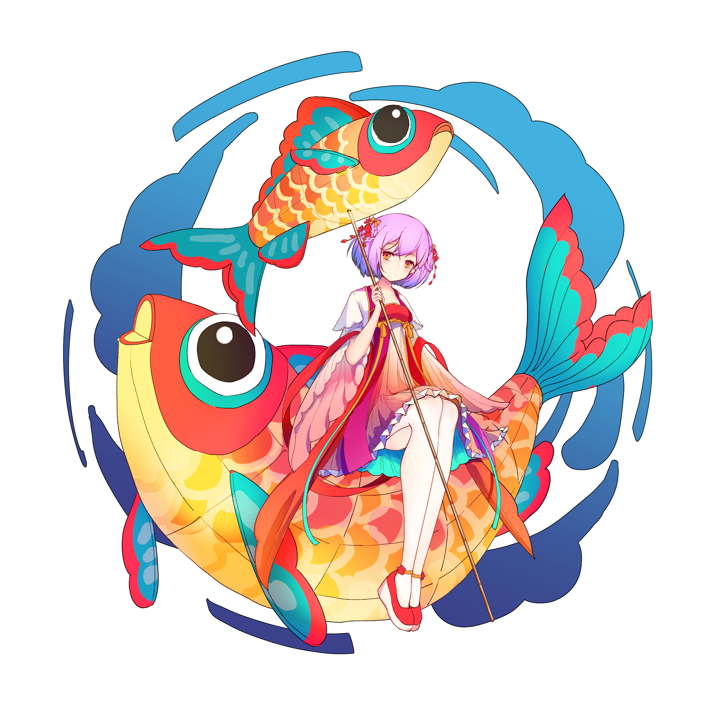

# Konado 可娜多：视觉小说框架

[English](README.md) | 简体中文 | [繁體中文](README.zh-TW.md) | [日本語](README.ja.md) | [한국어](README.ko.md) | [Español](README.es.md) | [Français](README.fr.md)

 

  
  
  
  
  
  
  
  

 

## 简介

Konado 是一个对话创建工具包，提供模板和对话管理器，帮助您快速构建视觉小说、GalGame、RPG 和其他故事驱动的项目。

## 快速开始

请参考 [快速开始](https://godothub.com/oss/konado/tutorial/install.html) 文档，了解如何快速开始使用Konado。

## 文档

欢迎访问我们的项目网站：https://godothub.com/oss/konado 获取更多详细文档和教程。

## 社区

欢迎加入我们的社区交流频道，与其他Konado用户交流经验，分享创意。您可以通过以下方式加入：

- 加入我们的 QQ 频道讨论组：[点击加入](https://pd.qq.com/g/godot)

- 加入我们的 Discord 群组频道：[点击加入](https://discord.com/channels/1378639076747513938/1425084240550166592)

## 赞助支持

欢迎通过此链接支持我们的工作：[爱发电赞助](https://afdian.com/item/52230b2860a011f083ef52540025c377)，
您的赞助将帮助我们持续完善 Konado 项目。

  

## 参与开发

详细贡献指南请参考 [CONTRIBUTING.md](./CONTRIBUTING.md)。

## 行为准则

本项目遵循 [Code of Conduct](./CODE_OF_CONDUCT.md) 行为准则。

## 项目贡献者

贡献者名单请查看 [AUTHORS.md](./AUTHORS.md)。

## 开源许可证

Konado 项目采用 BSD 3 条款许可证，具体条款详见 [LICENSE](./LICENSE) 文件。
