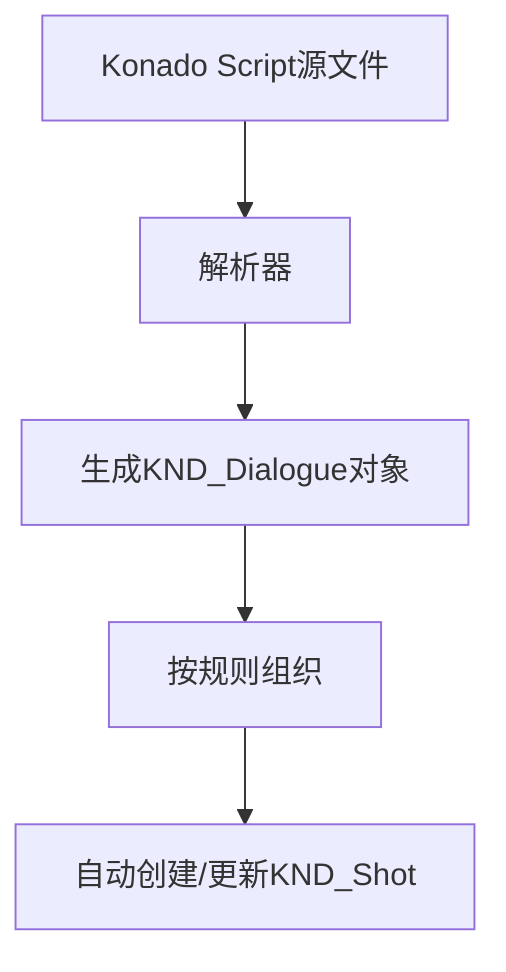

# KND_Shot 以及 KND_Dialogue

## 前言

这个章节将介绍 Konado 的两个核心类：KND_Shot 和 KND_Dialogue。这两个类是 Konado 的核心，用于表示对话镜头和对话。如果你希望深入了解 Konado 的架构原理，那么理解这两个类是非常重要的。在充分理解这两个类的基础上，你可以根据自己需要，对它们进行扩展和修改，以满足你的需求。

## KND_Shot

### 定义

KND_Shot 是 Konado 的一个核心类，用于表示一个对话镜头。

镜头是影视以及动画制作中的一个基本概念，它表示一个连续的画面，通常包含一系列的帧。在这里，KND_Shot 类用于表示一个对话镜头，其中包含了一系列对话。

当然也可以用书本的概念来理解，一个镜头就是一个小章节节，一个对话镜头就是一个小章节中的对话。

KND_Shot 将负责组织零散的 KND_Dialogue 数据对象，并按照一定的顺序排列它们，以便在播放时能够按照指定顺序播放。

当然，与电影镜头不同，KND_Shot 并不一定表示连续的，线性的故事，而是可能由多个 branch 分支组成，每个分支都包含一系列的对话，搭配 choice 来实现多选分支，让用户选择不同的对话路径。

### KND_Shot与Konado Script的关系

在使用过程中你不难发现，默认情况下，KND_Shot 并不需要手动创建，而是由 Konado Script 自动创建，并且自动更新数据的。这是由于我们采用了自定义的 Konado Script 语法，并使用了 Konado Script 的解析器来解析脚本文件，通过将源文件的行解析成 KND_Dialogue 对象，然后根据一定的规则将它们组织成 KND_Shot 对象。

如果用流程图来表示，那么从Konado Script 到多个 KND_Dialogue 到 KND_Shot 的过程大致如下：

如果你想详细了解 Konado Script 的解析过程，可以参考 Konado Script 的相关文档以及解析器的源代码。
