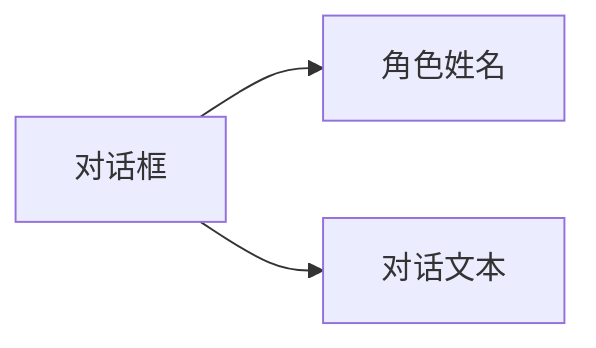

# 普通对话

## 功能描述


普通对话是游戏中常见的交互方式，用于角色与玩家之间的交流，通过角色名称、对话文本来呈现对话内容。

## 语法结构

```text
[角色] [对话文本] [配音标签]
```

## 参数说明

| 参数 | 必需 | 示例 | 说明 |
|------|------|------|------|
| 角色 | 是 | `alice` | 角色名称，用于显示对话框 |
| 对话文本 | 是 | `你好，我叫爱丽丝！` | 角色要说的话 |
| 配音标签 | 否 | `alice_intro_01` | 可选的标签，用于标识配音文件 |

## 示例

```text
# 普通对话
"alice" "你好，我叫爱丽丝！" alice_intro_01

# 旁白（无角色）
"narrator" "暴风雨越来越猛烈了..."
```