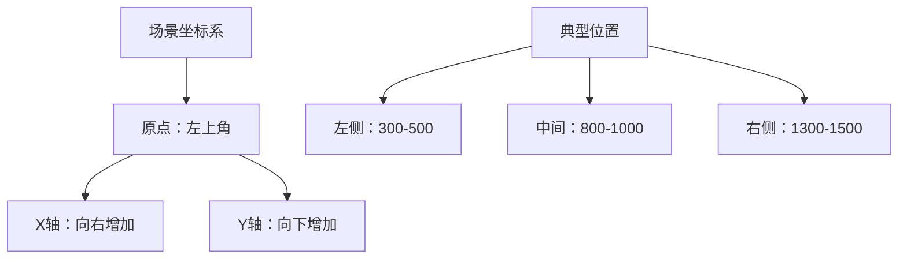

# 演员坐标与缩放

## 场景坐标系

对话中，演员的坐标决定了他们相对于场景的位置。原点位于左上角，X轴向右增加，Y轴向下增加。

## 演员缩放比例

演员的缩放比例决定了他们在场景中的大小。原点位于左上角，X轴向右增加，Y轴向下增加。

## 参考分辨率比例

为了适应不同分辨率比例的设备，演员的坐标和缩放比例是相对的，而不是绝对的。因此在项目中应确定统一的分辨率比例作为参考，并按照该比例设置演员的坐标和缩放比例。

推荐使用 `1920x1080` 作为参考分辨率比例，这样可以兼顾电脑和手机等不同设备。

如果你的目标设备分辨率比例是固定的（如一些游戏机设备），那么你可以使用该设备的分辨率比例作为参考，无需考虑其他设备。
